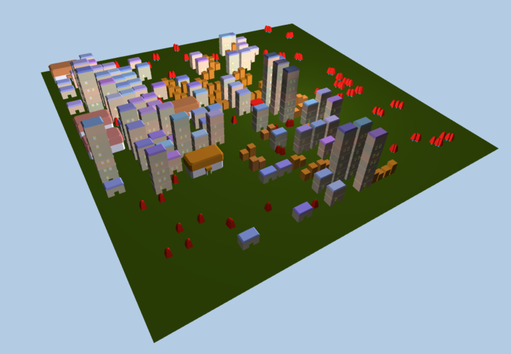
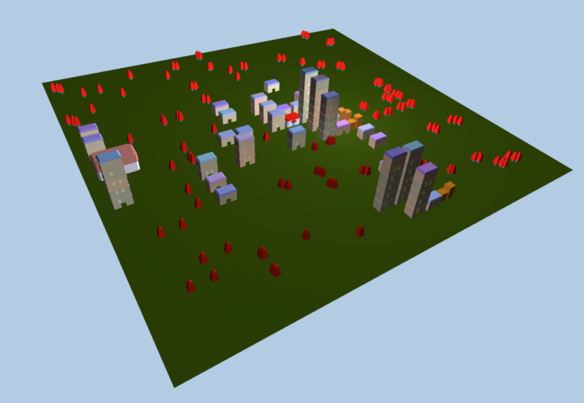
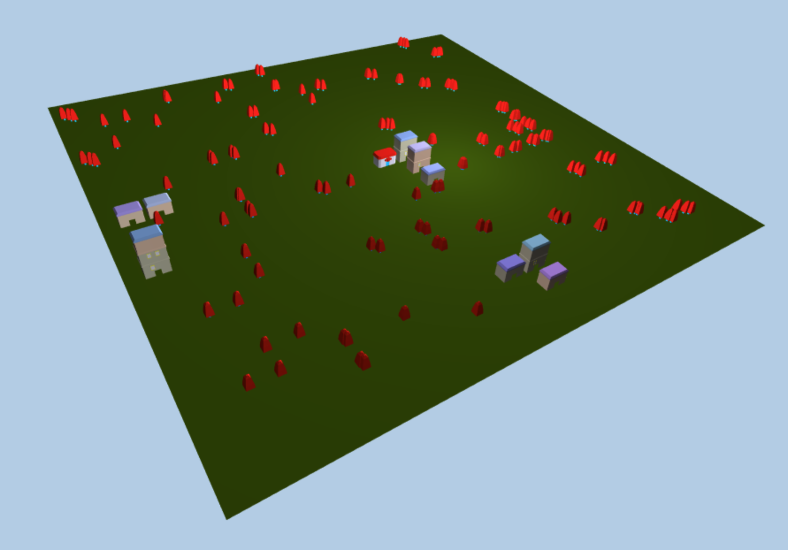

# Project 5: Shape Grammar

Charles Wang\
PennKey: chawang

## Pokemon Inspired Procedural City

This project is a procedural city (somewhat derived from Pokemon Fire Red/Leaf Green) built through iterative generation

## City Structure

The city has a uniform grid structure to prevent generation over existing buildings (Definitely the only reason was to stay true to pokemon grid format rather than out of laziness).

Trees are initially scattered but can be overriden by any building.

## Generation Rules

PokeCenter spawns building to its left (This rule is kind of pointless but ensures that buildings are nearby PokeCenter. Makes sense that near the PokeCenter is prime real estate?)

A stackable building may grow a level to a maximum of 7. Each level may have one or two windows. 

A stackable building may spawn a nearby stackable building (1 or 2 blocks away in any direction)

A stackable building may become a short split building if it is under a certain height

If there are 4 adjacent stackable buildings, they might be replaced by a Pokemon gym/dojo. (I guess Pokemon gyms are in the busiest locations?)

In general, I didn't want to assign "density" variables to areas because I wanted the nature of the area to be more influenced by previous states rather than underlying properties. 

Colors are position/height dependent
